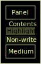
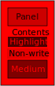
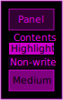
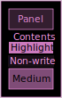
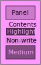
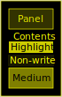

<!-- This file has been generated from ./bin/build. If you want to edit it, edit "./README.source.md" and then run ./bin/build again. -->
# colouredWeb

Making the web more accessible to people sensitive to particular colours and shades. An example of this is [Irlen Syndrome](http://en.wikipedia.org/wiki/Irlen_syndrome#Theory)

Historically I used this for generating custom StyleSheets for web browsers, and it worked excellently for years like this.

Now it needs some work to bring it up to the quality I want. But I have recently found it really good for generating custom CSS for other purposes, and my old CSS still works with everything I try it on! (That was a surprise.)

I suggest taking a look in [apps/](https://github.com/ksandom/colouredWeb/tree/master/apps) to see a list of apps where the install is currently automated. More coming soon.

## Alternatives for browsing

### What I recommend, where

* Firefox
  * [Dark background and light text](https://addons.mozilla.org/en-US/firefox/addon/dark-background-light-text/).
  * [Dark reader](https://addons.mozilla.org/en-US/firefox/addon/darkreader/).
* Chrome based
  * [Dark reader.](https://chrome.google.com/webstore/detail/dark-reader/eimadpbcbfnmbkopoojfekhnkhdbieeh)
  * [Dark background and light text](https://chrome.google.com/webstore/detail/dark-background-and-light/cdcoopnlkdlmphjpjggdmhohkiklonkh?hl=en) - _OH! I need to try this!_
* Safari
  * [Dark reader](https://darkreader.org/safari). - _I have not used it on this platform._
* Edge
  * [Dark reader](https://microsoftedge.microsoft.com/addons/detail/ifoakfbpdcdoeenechcleahebpibofpc). - _I have not used it on this platform._

### Overview of the plugins

"Dark background and light text" is really fast, and is my first choice. It works really well.

"Dark reader" looks gorgeous, and has some really nice controls for adjusting the look of pages. Some of the controls even apply to videos in pages. There is a performance impact, though. Especially on firefox.

Some sites work better in one or the other. So I typically have firefox and a chrome based browser open at the same time, each for different tasks.

Here is some [interesting discussion](https://www.reddit.com/r/firefox/comments/9mm9jw/best_dark_extension/) from other people on the topic, including some other plugins that I haven't tried yet.

## Install an app specific solution - USERS

Go in to the appropriate [apps/](https://github.com/ksandom/colouredWeb/tree/master/apps) folder and follow the instructions for that app.

## Installing & using colouredWeb for development - DEVELOPERS

### Install

    export extraSrc="https://github.com/ksandom/colouredWeb.git"; curl https://raw.githubusercontent.com/ksandom/achel/master/supplimentary/misc/webInstall | bash

### Using it

This re-colours all web pages to a colour that suits me very well. It's a dark, low-saturation, greeny-blue.

    $ colouredweb --colourByHex=99eeff --cwOut
    
      hexInput: 
        0: 153
        1: 238
        2: 255
    [debug0]: You will now need to run something like --cwOut to send this to some files.

This turns off the custom formatting.
Note that this isn't totally correct, in that it actually places syntactically incorrect CSS in place, so some glitches could be present, but I have yet to notice them. I will try to do this better in the near future.

    $ colouredweb --cwOut
    
      Chrome: 
        line: /home/ksandom/.config/google-chrome/Default/User StyleSheets/Custom.css
        key: Chrome
      Opera: 
        line: /usr/share/opera/user.css
        key: Opera

Actually, we want to make it a dark theme

    $ colouredweb --cwDark
    $ colouredweb --colourByHex=99eeff --cwOut
    
      hexInput: 
        0: 153
        1: 238
        2: 255
    [debug0]: You will now need to run something like --cwOut to send this to some files.

There is also `--cwBright`.

[More info](https://github.com/ksandom/colouredWeb/tree/master/packages-available/ColouredWeb/docs).

### How it works

#### Short

ColouredWeb generates a custom CSS that overrides the CSS that websites provide to make the web more useable to people who are sensitive to certain colours.

#### Long

Most modern browsers have the ability for the user to specify their own CSS file which can selectively override the formatting on websites. This is an excellent tool for making the web more accessible to people with specific requirements. The challenge is that there is no standard that most websites adhere to which makes it quite time consuming to make a CSS file that works everywhere.

That's where this project comes in. The idea is to make everything at least useable and secondly, most things fairly pretty (prefferably in the author's original flavour, but not at the expense of this project's standards.)

Chrome dropped support for this some time ago. I suggest taking a look at the [Alternatives for browsing](https://github.com/ksandom/colouredWeb#alternatives-for-browsing)

## Contributing

Pull requests welcome.

## Why not block ads?

Web developers and site owners can get passionately defensive of their website designs. It's going to be hard enough to get them to buy into a project like this that makes their site look different. Disabling ads on their sites would make it pretty much impossible since it would cut off a source of revenue for them.

## Preview of the themes

|  | cwBlack | cwBlackBlack | cwDark | cwBright |
| --- |:---:|:---:|:---:|:---: |
| 0000ff | | | |  |
| 00ff00 | | | |  |
| 00ffff | | | |  |
| 99eeff | | | |  |
| 99ffee | | | |  |
| 99ffff | | | |  |
| eeff99 | | | |  |
| ff0000 | | | |  |
| ff00ff | | | |  |
| ff99ee | | | |  |
| ff99ff | | | |  |
| ffee99 | | | |  |
| ffff00 | | | |  |
| ffff99 | | | |  |
| ffffff | | | |  |

