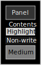
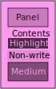
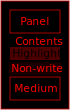

<!-- This file has been generated from ./bin/build. If you want to edit it, edit "./apps/kmail/README.source.md" and then run ./bin/build again. -->
# kmailMessageDarkMode

Dark mode (themeS) for recieved messages in KMail.

KMail already does a pretty good job at re-colouring HTML emails to the system theme. But misses a lot of third-party email. This fixes that, and the miss-matches when only one of the background or foreground are set.


## Requirements

### User

* make - To do the install/uninstall. (Can be done without it.)

### Developer

* make - To do the install/uninstall. (Can be done without it.)
* [colouredWeb](https://github.com/ksandom/colouredWeb) - To generate the CSS stylesheet.
* [shest](https://github.com/ksandom/shest) - To run the tests. There is a very basic test written in bash intended as a sanity check before installing.

## Install

### Install - In place method

1. Install it.
    ```bash
    sudo make install
    ```

### Install - Filter method

1. Test that it is in working order before installing.
    ```bash
    make test
    ```
1. Get the basics installed.
    ```bash
    sudo make install-filter
    ```
1. Create a mail filter to run the script when new mail comes in.
    1. "Settings"
    1. "Configure filters..."
    1. Create a new filter.
    1. "Match all messages" should be selected.
    1. Under "Filter Actions"
        1. Select "Pipe Through"
        1. Enter `/usr/bin/insertSheet`


Did it work? If you're not sure,

1. Select an HTML message.
1. Make sure it is showing HTML.
1. If you're still not seeing a change, press "v" to view source.
1. Click "HTML Source".
1. Look for `<head>`. Directly after it, you should see `<!-- Inserted stylesheet using kmailMessageDarkMode at` then the timestamp. A little after that is the magic that makes it all work.

## Want to show off?

```bash
sudo ./bin/showOff
```

Then open up the emails and see what happens ;)

After you're done, run `sudo ./bin/installSheet` to restore it to the default dark theme.

## Uninstall - In place method

This will restore the original stylesheet to it's original state, without the changes we made.

```bash
sudo make uninstall
```

## Uninstall - Filter method

This will remove the script and the stylesheet, which will cause kmail to revert to the formatting it would have otherwise used. It will not remove the seed from the emails that have already been processed.

```bash
sudo make uninstall-filter
```

## How it works

I've revived [one of my old projects](https://github.com/ksandom/colouredWeb) to generate various CSS stylesheets. These are committed into this repo, so there's no need to have that dependency, but you can.

At that point we just need to make kmail use it using one of the two methods below:

* "In place" - **You want this one, unless you have problems.** The custom stylesheet is appended to an existing stylesheet used for formatting message details in the header of the email output. If it successfully installs, there's very little to go wrong with it, but it could be fragile as kmail evolves and things need to get changed. )
* "Filter" - My first attempt. There's a bit more set-up involved, and sometimes it's frustrating to work out why something isn't working, but there's more power available to user to be able to fix things when things go wrong, without needing to dive into code.
    * A script and a CSS file are installed.
    * You create a mail filter that
        * Matches every message.
        * Modifies the message on your local machine.
            * Optional (default): Inserts a reference to the stylesheet into the message.
                * This modification will remain after uninstallion, but the changes will not be visible since the stylesheet will no longer be present.
                * I've laid the ground work so that this can be removed if there is a need for it.
            * Optional (default): Removes hard-coded colours.
                * This caters to **all** of the edge cases that I've found so far.
                * I don't yet know of any way to undo this, should you want to.

## Preview of the themes

|   | cwDark | cwBright | cwBlack | cwBlackBlack |
|:---:|:---:|:---:|:---:|:---:|
| ffffff | [](sheets/cwDark-ffffff.css) | [](sheets/cwBright-ffffff.css) | [](sheets/cwBlack-ffffff.css) | [](sheets/cwBlackBlack-ffffff.css) |
| 99eeff | [](sheets/cwDark-99eeff.css) | [](sheets/cwBright-99eeff.css) | [](sheets/cwBlack-99eeff.css) | [](sheets/cwBlackBlack-99eeff.css) |
| 99ffee | [](sheets/cwDark-99ffee.css) | [](sheets/cwBright-99ffee.css) | [](sheets/cwBlack-99ffee.css) | [](sheets/cwBlackBlack-99ffee.css) |
| eeff99 | [](sheets/cwDark-eeff99.css) | [](sheets/cwBright-eeff99.css) | [](sheets/cwBlack-eeff99.css) | [](sheets/cwBlackBlack-eeff99.css) |
| ffee99 | [](sheets/cwDark-ffee99.css) | [](sheets/cwBright-ffee99.css) | [](sheets/cwBlack-ffee99.css) | [](sheets/cwBlackBlack-ffee99.css) |
| ff99ee | [](sheets/cwDark-ff99ee.css) | [](sheets/cwBright-ff99ee.css) | [](sheets/cwBlack-ff99ee.css) | [](sheets/cwBlackBlack-ff99ee.css) |
| ff0000 | [](sheets/cwDark-ff0000.css) | [](sheets/cwBright-ff0000.css) | [](sheets/cwBlack-ff0000.css) | [](sheets/cwBlackBlack-ff0000.css) |
| 00ff00 | [](sheets/cwDark-00ff00.css) | [](sheets/cwBright-00ff00.css) | [](sheets/cwBlack-00ff00.css) | [](sheets/cwBlackBlack-00ff00.css) |
| 0000ff | [](sheets/cwDark-0000ff.css) | [](sheets/cwBright-0000ff.css) | [](sheets/cwBlack-0000ff.css) | [](sheets/cwBlackBlack-0000ff.css) |
| ffff00 | [](sheets/cwDark-ffff00.css) | [](sheets/cwBright-ffff00.css) | [](sheets/cwBlack-ffff00.css) | [](sheets/cwBlackBlack-ffff00.css) |
| ff00ff | [](sheets/cwDark-ff00ff.css) | [](sheets/cwBright-ff00ff.css) | [](sheets/cwBlack-ff00ff.css) | [](sheets/cwBlackBlack-ff00ff.css) |
| 00ffff | [](sheets/cwDark-00ffff.css) | [](sheets/cwBright-00ffff.css) | [](sheets/cwBlack-00ffff.css) | [](sheets/cwBlackBlack-00ffff.css) |
| ffff99 | [](sheets/cwDark-ffff99.css) | [](sheets/cwBright-ffff99.css) | [](sheets/cwBlack-ffff99.css) | [](sheets/cwBlackBlack-ffff99.css) |
| ff99ff | [](sheets/cwDark-ff99ff.css) | [](sheets/cwBright-ff99ff.css) | [](sheets/cwBlack-ff99ff.css) | [](sheets/cwBlackBlack-ff99ff.css) |
| 99ffff | [](sheets/cwDark-99ffff.css) | [](sheets/cwBright-99ffff.css) | [](sheets/cwBlack-99ffff.css) | [](sheets/cwBlackBlack-99ffff.css) |
